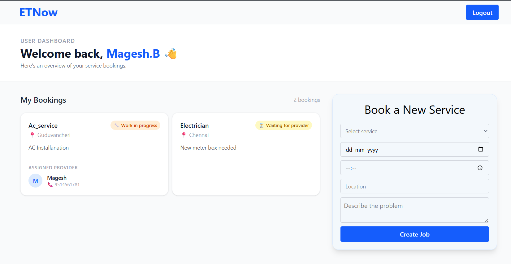

# 🔧 Service Booking Platform

A full-stack MVP web application that connects customers with home service providers (electricians, plumbers, carpenters, AC technicians) — with real-time job tracking from request to completion.

---

## 🚀 Live Demo

> _Coming soon 

---

## 📸 Screenshots

> 





---

## 🧩 Features

### Customer (User)
- Register / Login with email & password
- Browse and select a service from the landing page
- Create a job request with service type, date, time, location, and description
- Real-time job status tracking — Created → Accepted → In Progress → Completed
- View assigned provider's name and phone number once accepted

### Service Provider
- Role-based dashboard separate from customer view
- View all newly created (available) jobs in real time
- Accept jobs, mark them as started, and mark them as completed
- Kanban-style columns: Available → Accepted → Ongoing → Completed

### General
- Role-based authentication (Customer / Provider)
- Protected routes — unauthorized access redirects to login
- Forgot password via email reset
- Real-time updates using Firestore `onSnapshot` — no page refresh needed

---

## 🛠️ Tech Stack

| Layer | Technology |
|---|---|
| Frontend | React 19, React Router v7 |
| Styling | Tailwind CSS v4 |
| Backend / DB | Firebase Firestore (NoSQL, real-time) |
| Authentication | Firebase Auth |
| Build Tool | Vite |

---

## 🗂️ Project Structure

```
src/
├── App/
│   └── App.jsx              # Root component with all routes
├── Components/
│   ├── layout/
│   │   └── NavBar.jsx       # Top navigation bar
│   ├── ui/                  # Reusable UI components (Button, Input, StatusBadge)
│   └── ProtectedRoute.jsx   # Role-based route guard
├── Context/
│   └── AuthContext.jsx      # Global auth state (user, role, loading)
├── Pages/
│   ├── auth/                # Login, Register, ForgotPassword
│   ├── user/                # UserHome, CreateJob, UserJobDetails
│   └── provider/            # ProviderDashboard, ProviderJobDetails
├── Services/
│   ├── firebase.js          # Firebase app initialization
│   ├── authservice.js       # Register, Login, Logout, Reset password
│   └── jobservice.js        # Create, listen, accept, update jobs
└── utils/
    └── JobStatusMessage.js  # Maps status codes to readable labels
```

---

## ⚙️ Getting Started

### Prerequisites
- Node.js v18+
- A Firebase project (Firestore + Authentication enabled)

### Installation

```bash
# Clone the repo
git clone https://github.com/mageshbalasundaram/service-booking-app.git
cd service-booking-app

# Install dependencies
npm install
```

### Firebase Setup

Create a `.env` file in the root of the project:

```env
VITE_FIREBASE_API_KEY=your_api_key
VITE_AUTH_DOMAIN=your_project.firebaseapp.com
VITE_PROJECT_ID=your_project_id
VITE_STORAGE_BUCKET=your_project.firebasestorage.app
VITE_MESSAGING_SENDER_ID=your_sender_id
VITE_APP_ID=your_app_id
```

### Run Locally

```bash
npm run dev
```

---

## 🔄 Job Lifecycle

```
Customer creates job
        ↓
   status: "created"        ← Provider sees it in Available Jobs
        ↓
   Provider accepts
   status: "accepted"       ← Customer sees provider's name & phone
        ↓
   Provider starts work
   status: "in_progress"    ← Customer sees "Work has started"
        ↓
   Provider completes
   status: "completed"      ← Both sides see job as done
```

---

## 📌 What I Learned Building This

- Setting up Firebase Auth with role-based access control stored in Firestore
- Using `onSnapshot` for real-time UI updates without polling
- Managing global auth state with React Context API
- Passing data between pages using URL query params (`?service=electrician`)
- Structuring a React app with separation of concerns — Pages, Services, Context, Utils

---

## 👤 Author

**Magesh B**
[GitHub](https://github.com/mageshbalasundaram)